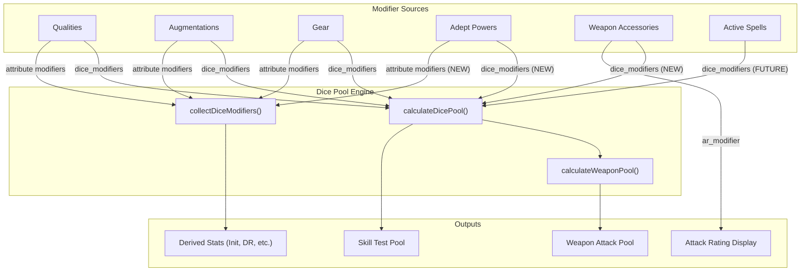
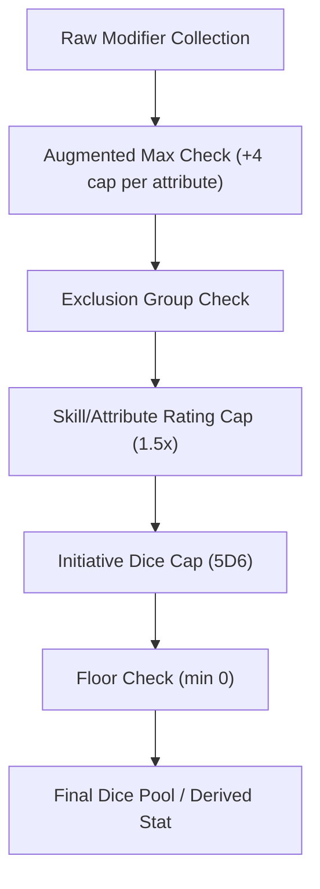

# Dice Pool Architecture

This document explains how dice pools are calculated in Shadow Dice Forge, catalogs every
Shadowrun 6th Edition factor that can affect them, identifies gaps between the rules and the
current implementation, and proposes a unified modifier architecture to close those gaps.

---

## 1. SR6 Dice Pool Formula (Rules Reference)

In SR6, nearly every test resolves by rolling a pool of six-sided dice. The size of that pool
depends on the type of test being made.

### Skill tests

```
Dice Pool = Attribute + Skill Rating + Modifiers
```

The linked attribute is defined per skill (e.g., Firearms uses Agility, Con uses Charisma).
Modifiers come from qualities, augmentations, gear, wound penalties, and situational factors.

### Weapon attack tests

```
Dice Pool = Attribute + Skill Rating + Modifiers + Specialization (+2) + Expertise (+3)
```

- Ranged weapons use **Agility + Firearms**.
- Melee weapons use **Agility + Close Combat** (or Exotic Weapons for exotic subtypes).
- Specialization bonus (+2) applies when the skill's specialization matches the weapon subtype.
- Expertise bonus (+3) applies when the skill's expertise matches the weapon subtype.
- Conditional modifiers (e.g., Smartlink +2 when weapon has a Smartgun System) layer on top.

### Defense tests

```
Dice Pool = Reaction + Intuition + situational modifiers
```

Combat Sense (adept power or spell), cover, and similar effects add dice to defense.

### Damage resistance (Defense Rating)

```
Defense Rating = Body + Armor Rating + DR modifiers
```

Not a dice pool per se, but determines whether the attacker or defender gains Edge. Armor
stacking rules apply (one body armor + one helmet + one shield).

### Drain resistance

```
Dice Pool = Willpower + tradition-linked attribute
```

Hermetic: WIL + LOG. Shamanic: WIL + CHA. Used to resist Drain from spellcasting.

### Fade resistance (Technomancers)

```
Dice Pool = Willpower + Resonance (or Logic, varies by form)
```

### Initiative

```
Initiative Score = Reaction + Intuition + modifiers
Initiative Dice  = 1D6 + bonus dice (max 5D6 total)
```

### Derived stats (attribute pairs)

| Stat | Formula |
|------|---------|
| Composure | WIL + CHA |
| Judge Intentions | WIL + INT |
| Memory | LOG + WIL |
| Lift/Carry | STR + BOD (carry), ×2 (lift) |
| Movement | (REA + STR) / 2 m |

---

## 2. Current Implementation

The app has three distinct calculation paths.

### Path A: Skill and weapon dice pools

**Files:** `src/lib/dice-pool.ts`

**`calculateDicePool()`** computes the base pool for any skill test:

```
Total = Attribute + Skill Rating + sum(Modifiers)
```

It iterates `dice_modifiers` from three sources, filtering to only non-attribute modifiers
(`!mod.attribute`):

1. **Qualities** (`SR6Quality.dice_modifiers`)
2. **Augmentations** (`SR6Augmentation.dice_modifiers`)
3. **Gear** (`SR6Gear.dice_modifiers`)
4. **Wound penalty** (flat negative from condition monitor)

Each modifier is also checked by `modifierApplies()`, which gates on `requires_accessory`:
if a modifier has `requires_accessory` set (e.g., `"Smartgun"` on the Smartlink augmentation),
it only applies when the weapon's accessories include a matching name (case-insensitive
substring match).

**`calculateWeaponPool()`** wraps `calculateDicePool()` and adds:

- **Specialization** (+2) when `skill.specialization === weaponSubtype`
- **Expertise** (+3) when `skill.expertise === weaponSubtype`

**Consumers:**

| Component | Context |
|-----------|---------|
| `PrimaryEquipmentBlock.tsx` | Core page primary weapon pool |
| `EquippedGearTab.tsx` | Pool pill on each equipped weapon |
| `SkillsTab.tsx` | Per-skill pool display |

### Path B: Derived stats (attribute modifiers)

**File:** `src/components/character/AttributesTab.tsx`

**`collectDiceModifiers(attrKey)`** scans qualities, augmentations, and gear for
`dice_modifiers` where `mod.attribute === attrKey`. Used for:

- `defense_rating` — adds to BOD + armor for total DR
- `initiative` — flat bonus added to REA + INT
- `initiative_dice` — bonus D6 (capped at 5 total)
- Core attributes (`body`, `agility`, `reaction`, `strength`, etc.) — displayed in
  attribute tooltips

Respects `equipped === false` for gear filtering; augmentations are always treated as equipped.

### Path C: Attack Rating display

**Files:** `src/components/character/PrimaryEquipmentBlock.tsx`, `src/lib/ar-utils.ts`

- Weapon base AR + accessory `ar_modifier` fields (e.g., `"+2/+2/+2/+2/+2"`)
- Computed via `accessoriesToARModifiers()` → `calculateModifiedAR()`
- Displayed on the Core page and Equipped Gear tab

### Wound penalty calculation

**File:** `src/lib/condition-monitor.ts`

```
Wound Modifier = -(floor(physical_damage / 3) + floor(stun_damage / 3))
```

Always negative (or zero). Applied to all tests except Damage Resistance (GM discretion).

---

## 3. Complete Modifier Source Catalog

Every data source and the modifiers it can contribute.

### Augmentations (`src/data/gear/augmentations.yaml`)

**Structured `dice_modifiers`:**

| Augmentation | Modifier | Field |
|---|---|---|
| Muscle Replacement | +1 STR | `{ attribute: "strength", value: 1 }` |
| Muscle Toner | +1 AGI | `{ attribute: "agility", value: 1 }` |
| Muscle Augmentation | +1 STR | `{ attribute: "strength", value: 1 }` |
| Wired Reflexes (R2) | +2 REA | `{ attribute: "reaction", value: 2 }` |
| Reaction Enhancers (R1) | +1 REA | `{ attribute: "reaction", value: 1 }` |
| Smartlink | +2 dice (requires Smartgun) | `{ value: 2, requires_accessory: "Smartgun" }` |
| Tailored Pheromones (R1) | +1 CHA | `{ attribute: "charisma", value: 1 }` |
| Cerebral Booster (R1) | +1 LOG | `{ attribute: "logic", value: 1 }` |

**Text-only effects (not yet structured as `dice_modifiers`):**

| Augmentation | Effect | Missing modifier |
|---|---|---|
| Wired Reflexes | +Xd6 Initiative | `{ attribute: "initiative_dice", value: X }` |
| Synaptic Booster | +Xd6 Initiative | `{ attribute: "initiative_dice", value: X }` |
| Dermal Plating | +X damage resistance | `{ attribute: "defense_rating", value: X }` |
| Orthoskin | +X damage resistance | `{ attribute: "defense_rating", value: X }` |
| Bone Lacing/Density | +1 Physical CM box, unarmed DV | Multiple effect types |
| Platelet Factory | +2 to First Aid (stabilizing) | `{ skill: "Biotech", value: 2 }` |
| Synthskin | +2 to Disguise | `{ skill: "Con", value: 2 }` (contextual) |

### Adept Powers (`src/data/magic/adept-powers.yaml`)

**Structured `dice_modifiers`:**

| Power | Modifier | Field |
|---|---|---|
| Improved Physical Attribute (AGI) | +1 AGI | `{ attribute: "agility", value: 1 }` |
| Improved Physical Attribute (STR) | +1 STR | `{ attribute: "strength", value: 1 }` |
| Improved Physical Attribute (BOD) | +1 BOD | `{ attribute: "body", value: 1 }` |
| Improved Physical Attribute (REA) | +1 REA | `{ attribute: "reaction", value: 1 }` |
| Improved Reflexes (1-4) | +1..4 REA | `{ attribute: "reaction", value: 1..4 }` |

**Text-only effects (not yet structured):**

| Power | Effect | Missing modifier type |
|---|---|---|
| Improved Reflexes (1-4) | +1..4 Initiative Dice | `{ attribute: "initiative_dice" }` |
| Combat Sense | +1 dice to defense tests per level | Defense dice modifier |
| Critical Strike | +1 DV with melee/unarmed per level | DV modifier |
| Enhanced Accuracy | +2 Attack Rating | AR modifier |
| Mystic Armor | +1 Armor (DR) per level | `{ attribute: "defense_rating" }` |
| Adrenaline Boost | +2 Initiative per level | `{ attribute: "initiative" }` |
| Improved Ability | +X to a chosen skill | `{ skill: "<chosen>", value: X }` |
| Pain Resistance | Condition monitor penalty shift | Condition monitor modifier |

### Qualities (on character data, no reference YAML)

- `dice_modifiers` array on `SR6Quality`
- Can target specific skills (`skill` field) or be universal
- Can gate on weapon accessories (`requires_accessory` field)

### Weapon Accessories (`src/data/gear/weapon-accessories.yaml`)

**Structured:**

| Field | Example | Used in |
|---|---|---|
| `ar_modifier` | `"+2/+2/+2/+2/+2"` | AR display via `calculateModifiedAR()` |

**Not structured:**

| Accessory | Effect | Status |
|---|---|---|
| Smartgun System (internal/external) | +1 dice pool (wireless) | Description text only |
| Smartgun System | +2 AR | Structured via `ar_modifier` |
| Bipod | +3 AR when prone (wireless) | `ar_modifier_wireless` stored, converted to `notes` |
| Laser sight | +2 AR (wireless) | `ar_modifier_wireless` stored, converted to `notes` |

The `WeaponAccessory` type has no `dice_modifiers` field. Accessories cannot contribute
dice pool bonuses.

### Spells (`src/data/magic/spells.yaml`)

No `dice_modifiers` field. All effects are narrative or depend on spellcasting net hits:

| Spell | Effect |
|---|---|
| Armor | Adds net hits to Defense Rating |
| Combat Sense | Net hits add to Defense Rating and Surprise tests |
| Increase Reflexes | Increases Reaction and Initiative Dice |
| Decrease [Attribute] | Reduces target's attribute |

These are situational/sustained and would require active-spell tracking to affect pools.

### Armor (`src/data/gear/armor.yaml`)

- `rating` → contributes to Defense Rating in `computeDerived()`
- `subtype` → `"body"`, `"helmet"`, or `"shield"` for stacking rules
- No `dice_modifiers` field
- Some armor has wireless bonuses in description only (e.g., Chameleon Suit +2 DR wireless)

### Ranged Weapons (`src/data/gear/ranged-weapons.yaml`)

- `dv`, `ar`, `fire_modes`, `ammo` — combat stats, not dice pool modifiers
- `subtype` — used for specialization/expertise matching
- `accessories` — list of `WeaponAccessory` objects, used for AR modifiers and
  `requires_accessory` gating

### Melee Weapons (`src/data/gear/melee-weapons.yaml`)

- `dv`, `ar`, `reach` — combat stats
- `subtype` — used for specialization/expertise matching
- No `dice_modifiers`

### Miscellaneous Gear (`src/data/gear/miscellaneous.yaml`)

- `dice_modifiers` field exists on every entry but is always `[]`
- Effects described in `notes` only (e.g., Medkit Rating 6: +3 to First Aid tests)

### Electronics, Vehicles, Drones

No dice pool contributions in the current data model.

---

## 4. Identified Gaps

Gaps between SR6 rules and the current implementation, ordered by impact.

### Gap 1: Adept powers excluded from dice pool calculation

`calculateDicePool()` accepts qualities, augmentations, and gear — but **not** adept powers.
`collectDiceModifiers()` also omits them. The `SR6AdeptPower` type has a `dice_modifiers`
field and the YAML data populates it for Improved Physical Attribute and Improved Reflexes,
but these modifiers are never read by any calculation.

**Impact:** Adept characters get no attribute or skill bonuses from their powers.

### Gap 2: Weapon accessories cannot provide dice modifiers

The `WeaponAccessory` interface has `name`, `ar_modifier`, `notes`, and `description` — but
no `dice_modifiers`. The Smartgun System's +1 wireless dice pool bonus exists only in
description prose. `calculateDicePool()` treats `weaponAccessories` as a passive gate (for
`requires_accessory` checks) but never extracts modifiers from them.

**Impact:** Smartgun's own +1 wireless bonus is never applied.

### Gap 3: Initiative dice not structured

Wired Reflexes, Synaptic Booster, and Improved Reflexes all describe initiative dice bonuses
in their `effects` text but lack structured `dice_modifiers` entries with
`attribute: "initiative_dice"`. The `collectDiceModifiers("initiative_dice", ...)` call finds
nothing for these items.

**Impact:** Initiative dice display may be incorrect for augmented characters.

### Gap 4: Defense test dice not structured

Combat Sense (adept power) provides "+1 dice to defense tests per level" but has empty
`dice_modifiers: []`. There is no mechanism to apply defense-specific dice bonuses to
defense tests.

**Impact:** Adept defense bonuses are invisible.

### Gap 5: AR bonuses from adept powers not structured

Enhanced Accuracy provides "+2 Attack Rating with any weapon" but has no structured AR
modifier field. Adept powers have no way to contribute to AR calculations.

**Impact:** Adept AR bonuses are invisible.

### Gap 6: Armor DR bonuses from wireless

Chameleon Suit and similar armor items describe wireless DR bonuses in description text only.
There is no wireless toggle or structured `dice_modifiers` on armor.

**Impact:** Wireless armor bonuses cannot be surfaced.

### Gap 7: Miscellaneous gear effects not structured

Medkit (+3 to First Aid), Stim Patches, and other gear describe dice bonuses in `notes` but
have empty `dice_modifiers` arrays.

**Impact:** Gear situational bonuses are invisible to the pool calculator.

### Gap 8: Spell effects not modeled

Sustained spells like Armor, Combat Sense, and Increase Reflexes dynamically affect pools
based on net hits from the casting test. These require an "active spells" tracking system to
contribute modifiers.

**Impact:** Spell-based buffs cannot be reflected in displayed pools.

### Gap 9: Edge bonuses not tracked

Many adept powers and qualities grant bonus Edge in specific situations (Danger Sense,
Kinesics, Improved Sense, Enhanced Perception). The app has no structured way to surface
these as reminders during play.

**Impact:** Players must remember Edge-granting abilities manually.

---

## 5. Proposed Unified Modifier Architecture

### Data flow diagram



### Proposed changes (priority order)

**Priority 1 — Add adept powers to `calculateDicePool` and `collectDiceModifiers`**

The `SR6AdeptPower` type already has `dice_modifiers`. The data is already populated in the
YAML. The only missing piece is passing adept powers into the calculation functions.

- Add `adeptPowers?: SR6AdeptPower[]` parameter to `calculateDicePool()`
- Iterate `adeptPowers` the same way as augmentations (with `modifierApplies()` gating)
- Add adept powers to `collectDiceModifiers()` scan list
- Thread `adeptPowers` through all consumers (`PrimaryEquipmentBlock`, `EquippedGearTab`,
  `SkillsTab`, `AttributesTab`)

**Priority 2 — Add `dice_modifiers` to `WeaponAccessory` type**

Allow accessories like Smartgun to carry structured dice modifiers.

- Add `dice_modifiers?: DiceModifier[]` to `WeaponAccessory` interface
- Update `calculateDicePool()` to iterate `weaponAccessories` for their own modifiers
  (in addition to using them as a gate for `requires_accessory`)
- Add `dice_modifiers` to the Smartgun entries in `weapon-accessories.yaml`
- Update `referenceToWeaponAccessory()` to carry `dice_modifiers` through

**Priority 3 — Populate missing structured `dice_modifiers` in YAML**

Fill in text-only effects as structured data:

- Wired Reflexes: add `{ attribute: "initiative_dice", value: X }`
- Synaptic Booster: add `{ attribute: "initiative_dice", value: X }`
- Improved Reflexes: add `{ attribute: "initiative_dice", value: X }`
- Combat Sense: add defense dice modifiers
- Mystic Armor: add `{ attribute: "defense_rating", value: X }`
- Adrenaline Boost: add `{ attribute: "initiative", value: X }`

**Priority 4 — Wireless toggle system (future)**

- Add `wireless?: boolean` to weapon accessories and certain gear items
- Add `requires_wireless?: boolean` to `DiceModifier`
- Only apply wireless-gated modifiers when the toggle is active

**Priority 5 — Active spell tracking (future)**

- Add an `active_spells` array to the character model
- Each entry specifies the spell, net hits, and resulting `dice_modifiers`
- Feed active spells into the dice pool engine alongside other sources

---

## 6. DiceModifier Schema Reference

### Current interface

```typescript
// src/types/character.ts
export interface DiceModifier {
  value: number;              // +/- modifier amount
  source: string;             // Display label (e.g., "Smartlink", "Wired Reflexes")
  skill?: string;             // Apply only to this skill's tests
  attribute?: string;         // Apply to this derived stat instead of skill tests
  requires_accessory?: string; // Gate: only when weapon has matching accessory
}
```

### Routing rules

The `attribute` and `skill` fields determine how a modifier is routed:

| `attribute` | `skill` | Routing |
|---|---|---|
| set | — | `collectDiceModifiers(attrKey)` for derived stat display |
| not set | set | `calculateDicePool()`: applies only when computing that skill's pool |
| not set | not set | `calculateDicePool()`: applies to ALL skill pools (subject to `requires_accessory`) |

### Supported `attribute` values

| Value | Used by | Effect |
|---|---|---|
| `body` | `AttributesTab` | Modifies Body attribute total |
| `agility` | `AttributesTab` | Modifies Agility attribute total |
| `reaction` | `AttributesTab` | Modifies Reaction attribute total |
| `strength` | `AttributesTab` | Modifies Strength attribute total |
| `willpower` | `AttributesTab` | Modifies Willpower attribute total |
| `logic` | `AttributesTab` | Modifies Logic attribute total |
| `intuition` | `AttributesTab` | Modifies Intuition attribute total |
| `charisma` | `AttributesTab` | Modifies Charisma attribute total |
| `defense_rating` | `computeDerived()` | Added to BOD + armor for total DR |
| `initiative` | `computeDerived()` | Flat bonus to REA + INT initiative score |
| `initiative_dice` | `computeDerived()` | Bonus D6 (capped at 5 total) |

### Conditional gating: `requires_accessory`

When set, the modifier only applies if the weapon being evaluated has an accessory whose
name contains the specified string (case-insensitive substring match).

```
modifierApplies(mod, weaponAccessories):
  if mod.requires_accessory is not set → always applies
  if weaponAccessories is empty        → does not apply
  otherwise                            → applies if any accessory name includes the string
```

Example: Smartlink's modifier `{ value: 2, requires_accessory: "Smartgun" }` only applies
when the weapon has an accessory like "Smartgun System (Internal)".

### Proposed additions to `DiceModifier`

| Field | Type | Purpose |
|---|---|---|
| `requires_wireless?: boolean` | boolean | Only apply when item's wireless toggle is on |
| `exclusion_group?: string` | string | Prevents stacking with other modifiers in the same group |
| `max_value?: number` | number | Cap this modifier's contribution (for 1.5x rules) |

---

## 7. Rules Constraints and Caps

SR6 imposes several limits on how modifiers stack and what values they can reach.

### 7.1 Augmented Maximum (+4 Cap)

Each physical and mental attribute can receive a maximum of **+4 total** from all
augmentation sources combined (cyberware, bioware, adept powers, sustained spells).

```
Augmented Maximum = Metatype Natural Maximum + 4
```

Examples using metatype data from `METATYPE_DATA` in `src/data/sr6-reference.ts`:

| Metatype | STR Max | Augmented STR Max |
|---|---|---|
| Human | 6 | 10 |
| Ork | 8 | 12 |
| Troll | 10 | 14 |
| Elf | 6 | 10 |
| Dwarf | 8 | 12 |

**Current status:** Not enforced. No code checks whether the sum of attribute-keyed
`dice_modifiers` from augmentations + adept powers exceeds +4. The metatype maximum data
is available but unused for this purpose.

### 7.2 Initiative Dice Cap (5D6)

Maximum of 5 initiative dice total (base 1D6 + up to 4 bonus dice).

**Current status:** Enforced in `AttributesTab.tsx`:

```typescript
const totalInitDice = Math.min(1 + initDiceBonus, 5);
```

The tooltip also indicates when capping occurs.

### 7.3 Exclusive / Mutually Exclusive Augmentations

Certain augmentations are explicitly incompatible:

| Group | Members | Rule |
|---|---|---|
| Initiative/Reaction boost | Improved Reflexes, Wired Reflexes, Synaptic Booster, Move-by-Wire | "Cannot be combined with any other Initiative or Reaction boosts" |
| Strength augmentation | Muscle Replacement, Muscle Toner, Muscle Augmentation | Same attribute, different methods; do not stack |
| Damage resistance armor | Dermal Plating, Orthoskin | "Does not stack with worn armor for the same damage type" |

**Current status:** Not enforced. No exclusion group or `incompatible_with` field exists.
A character could equip conflicting augmentations and receive stacked bonuses without warning.

**Proposed:** Add an optional `exclusion_group?: string` field to augmentation entries or
`DiceModifier` entries, allowing the engine to detect conflicts and surface warnings.

### 7.4 Improved Ability Skill Cap (1.5x Natural Rating)

The Improved Ability adept power boosts a skill by its power level, but the boost cannot
exceed **1.5 times the character's natural skill rating** (rounded up) or the augmented
maximum, whichever is lower.

Example: A character with Firearms 4 can boost it by at most +6 (1.5 × 4) via Improved
Ability.

**Current status:** Not enforced. The power's `dice_modifiers` are currently empty `[]`
(not yet structured for dice pool contribution). When implemented, the cap will need to
compare the boost against the character's natural skill rating.

### 7.5 Improved Physical Attribute Cap (1.5x or Augmented Max)

The Improved Physical Attribute adept power boosts an attribute, capped at **1.5 times the
natural attribute rating** or the augmented maximum, whichever is lower.

**Current status:** Not enforced. The `dice_modifiers` provide flat values (e.g., `+1 AGI`)
without any cap check.

### 7.6 Dice Pool Floor (Minimum 0)

A dice pool can never go below zero, regardless of negative modifiers.

**Current status:** Enforced via `Math.max(0, total)` in both `calculateDicePool()` and
`calculateWeaponPool()`.

### 7.7 Armor Stacking (One Per Subtype)

Only one body armor + one helmet + one shield can contribute to Defense Rating simultaneously.

**Current status:** Enforced in `computeDerived()` in `AttributesTab.tsx`. The function
selects the best-rated item from each subtype (`body`, `helmet`, `shield`) and sums their
ratings.

### 7.8 Edge Gain Limits

- Maximum of **2 Edge gained per combat round** (general rule).
- Many abilities specify "only one Edge point per encounter" (Kinesics, Vocal Control,
  Improved Sense).
- These affect Edge economy rather than dice pool math.

**Current status:** Not tracked. Edge bonuses from powers and qualities exist only in
description text. A future "Edge reminder" or "Edge tracker" feature could surface these
during play, but this is low priority for the dice pool architecture.

### 7.9 Proposed Constraint Enforcement Pipeline

When computing a final dice pool or derived stat, modifiers should pass through a validation
pipeline after collection:



Each stage:

1. **Augmented Max Check** — Sum all attribute modifiers from augmentations and adept powers;
   clamp to +4 above base. Requires metatype max from `METATYPE_DATA`.
2. **Exclusion Group Check** — If multiple modifiers share the same `exclusion_group`, keep
   only the highest and warn the user about the conflict.
3. **Skill/Attribute Rating Cap** — For powers like Improved Ability and Improved Physical
   Attribute, clamp the bonus to 1.5x the natural rating.
4. **Initiative Dice Cap** — Clamp total initiative dice to 5.
5. **Floor Check** — Ensure the final value is at least 0.

Warnings should be surfaced to the user in tooltips when a cap reduces their expected bonus.
